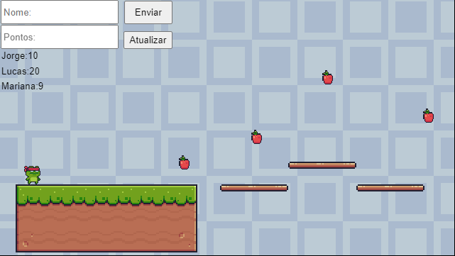
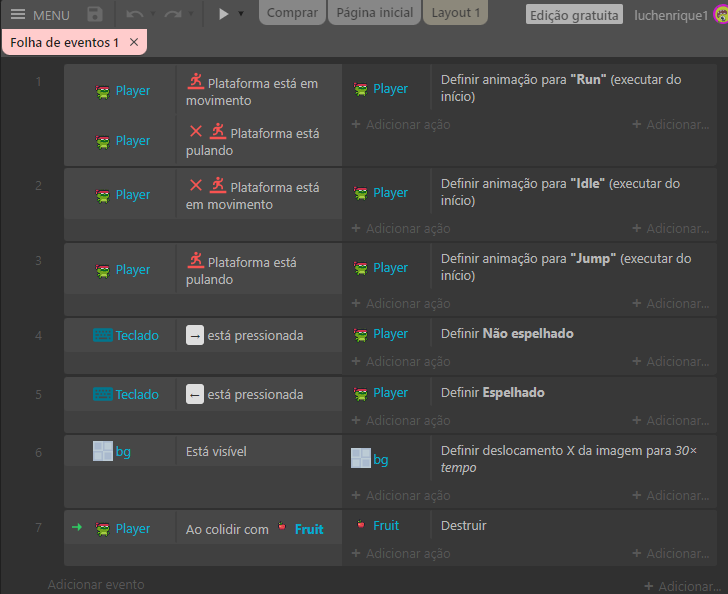
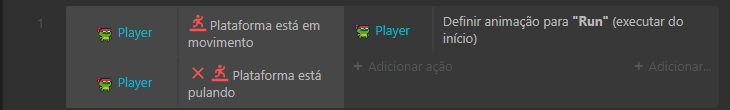
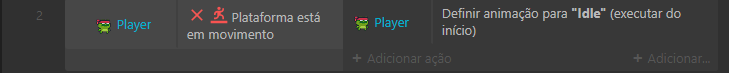
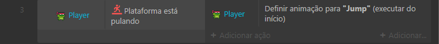
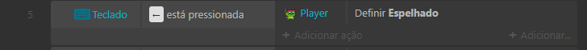
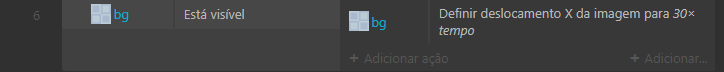
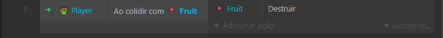

<h1>🐸Jump Frog</h1>

<h2>O que é?</h2>
Jogo trata-se de um pequeno sapo aventureiro que adora maçãs🍎.

<h2>Jogabilidade</h2>
<h3> Movimentação:</h3>
- Seta direira: Personagem se move para direita.  
- Seta esquerda: Personagem se move para esquerda.  
- Espaço: Personagem pula.

<h3> Objetivo </h3>
- Capturar todas as maças do mapa.

<h2>Dentro do game</h2>

<h3>Tela principal </h3>

<h3> Folha de eventos </h3>

<h3> Evento 1 </h3>

Define a ação de movimento "Run" para o personagem e faz a execução parar quando o mesmo pula.

<h3> Evento 2 </h3>

Quando o personagem não está em movimento, o mesmo ficara na função "Idle".

<h3> Evento 3 </h3>

Define a ação de pulo "Jump" para o personagem quando ele pula.

<h3> Evento 4 </h3>

Mantém a forma normal do personagem quando o personagem anda para direita.

<h3> Evento 5 </h3>

Espelha o evento 4 quando o personagem se movimenta para esquerda.

<h3> Evento 6 </h3>

Faz o fundo "bg (Backgroud)" se movimentar para a direita.

<h3> Evento 7 </h3>

Quando o personagem encosta na fruta, as mesma desaparece com a função de destruir.

<h2>Link do jogo</h2>

Link 1 (Jogo na Web): https://luchenrique.itch.io/jump-frog  
Link 2 (Download): https://github.com/luchenrique/jump-frog/blob/main/jump-frog.c3p
